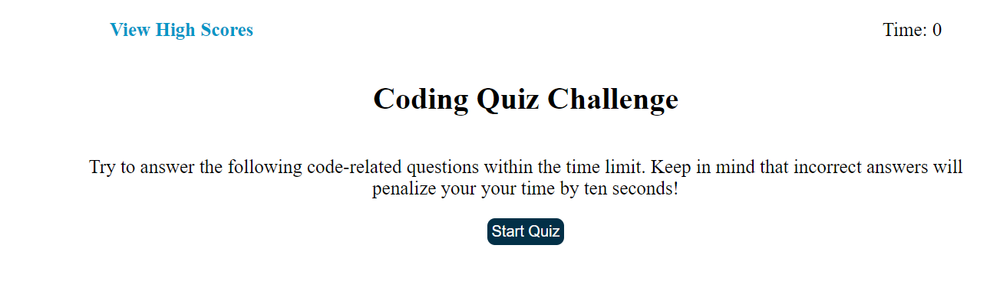
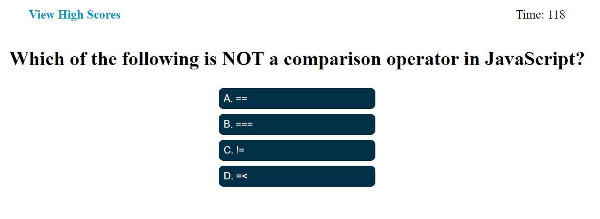

# JavaScript-Fundamentals-Quiz

## Description

This application is a quiz game that users can use to test their knowledge of the JavaScript Fundamentals. I designed this quiz because I wanted a way to allow my classmates to test their knowledge of JavaScript concepts and to see who can get the highest score.

## Installation

N/A

## Usage
To see this application in action you can click the following link: https://shaneleejohnson.github.io/JavaScript-Fundamentals-Quiz/

This application is a quiz and upon loading the webpage you will see a "view high scores" link that you can click on to see your previous scores if you have any and you will also see a "Start Quiz" button. When you click the button the quiz starts and the first question along with multiple choice answers will appear. A timer in the top right of the screen will start counting down from 120 seconds giving you 2 minutes to try and answer all 20 questions. When you have answered all questions or have ran out of time, you will be taken to the game over screen. Here you can enter your initials and when you click submit your initials and score will be saved locally and appear on the highscores list. While on the highScores page you can either click back to return to the starting screen or clear to clear all of the scores.

## Credits

N/A

## License

Please refer to the license in the repo.